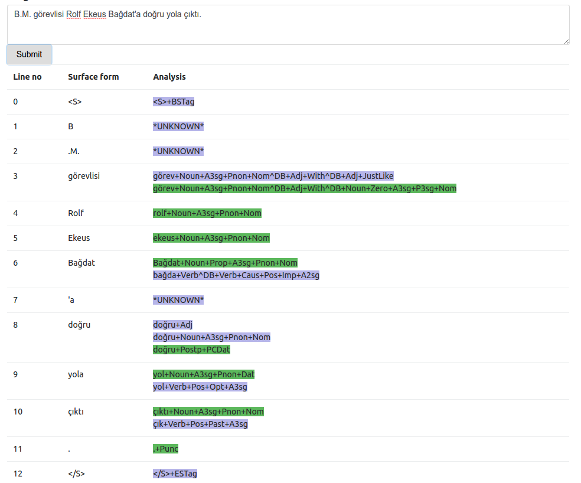
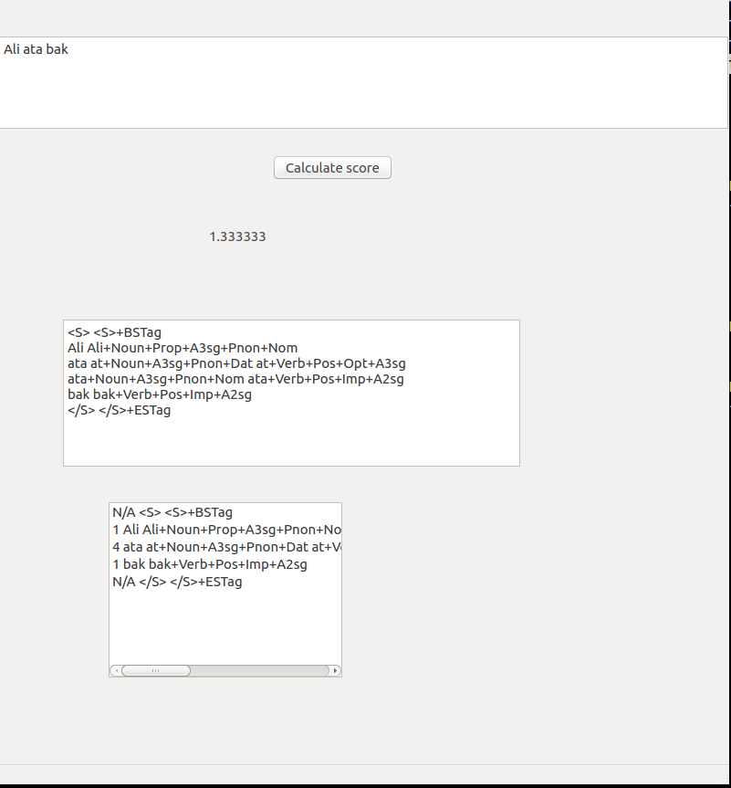

# neural-turkish-morphological-disambiguator
Implementation of Shen et al.'s "The Role of Context in Neural Morphological Disambiguation"

## Training

```bash
python train.py --command train --train_filepath data/train.merge.utf8 --test_filepath data/test.merge.utf8 --run_name nmd-20170619-06
```


## Prediction

```bash
python train.py --command predict --train_filepath data/train.merge.utf8 --test_filepath data/test.merge.utf8 --model_path ./models/ntd-nmd-20170619-06.epoch-32-val_acc-0.99507.hdf5 --run_name testing
```

### Disambiguating a sentence

```bash
python train.py --command disambiguate --train_filepath data/train.merge.utf8 --test_filepath data/test.merge.utf8 --model_path ./models/ntd-nmd-20170619-06.epoch-32-val_acc-0.99507.hdf5 --label2ids_path ./models/ntd-nmd-20170619-06.epoch-32-val_acc-0.99507.hdf5.label2ids --run_name testing
```

## Results

```
Evaluation finished, batch_id: 42
only the filled part of the sentence
868
889
0.976377952756
all the sentence
2817
2838
0.992600422833
===
ambigous
369
390
0.946153846154
===
disambiguations out of n_analyses: 2 ===> 1.000000 219 219
disambiguations out of n_analyses: 3 ===> 0.916667 55 60
disambiguations out of n_analyses: 4 ===> 0.853333 64 75
disambiguations out of n_analyses: 5 ===> 0.882353 15 17
disambiguations out of n_analyses: 6 ===> 0.888889 8 9
disambiguations out of n_analyses: 8 ===> 0.777778 7 9
disambiguations out of n_analyses: 12 ===> 1.000000 1 1
```

# Web demo

```
python webapp.py --command disambiguate --train_filepath data/train.merge.utf8 --test_filepath data/test.merge.utf8 --model_path ./models/ntd-nmd-20170619-06.epoch-32-val
```

Example screenshot:



# Desktop app

WIP: Implemented a very simple and ugly GUI to get morphological analyzes of a given sentence

```
python utils.py --command gui --output_dir stats_train_merge --gold_data 1 --verbose 1
```



# Docker instance

For easier installation, I have created a Dockerfile which can be used to 
run all functions easily. To use

```bash

docker build -t my_neural_turkish_disambiguator:0.0.1 .

```

Run the following to have a shell where you can run the training,
prediction, disambiguation and webapp features. 
You can just use volumes to persist created files. Please see the [releases page](./releases)
for the model files.

```bash
docker run -ti -p 10001:10001 -v neural_data_volume:/opt/neural-turkish-disambiguator my_neural_turkish_disambiguator:0.0.1

```
